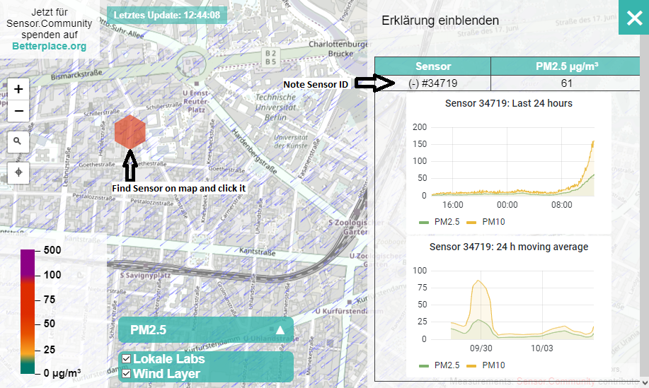

# Air-Quality-Data-Sonification

***Important!***: Due to some problems with RStudio in Windows handling SSL Certificates, I removed *https* from the R script.

Air Qality Data Sonification is a project to make air pollution audible.

It makes use of R to scrape Air Pollution Data from [sensor.community](https://sensor.community) and SuperCollider to make the data audible.

## Usage

The project is split into two parts. First, the data collection with R and than the sonification in SuperCollider.

### Data collection in R

The File *scrape_sensor-community.R* provides two functions to create data sets. It scrapes the data from [archive.sensor.community](https://archive.sensor.community/) and stores the result and also the raw data files in the directory ./data/*

```R
create_set_inherit(id, type, start, end)
create_set_moving_mean(id, type, start, end, dt, tmean)
```

- **id:** Sensor number, eg. *5710*
- **type:** Sensor type, eg *sds011*
- **start** Start timestemp, eg. *2021-09-01 08:00:00*
- **end** End timestemp, eq. *2021-09-01 16:15:31*
- **dt** Timestep (in s) in created Set, eq. *3600*
- **tmean** Time intervall (in s) to calculate moving mean over, eq *60*

To have a look at the downloaded data, you can use the *plot_set("path to .csv file", "title")* function.

### Sonificaiton in SuperCollider

There are severall options in the GUI to shape the sonification. First there is the fundamental frequency and amplitude for the sound. Than you can choose a scale to modify the Air-Quality-Index (AQI) to frequency mapping. This project makes use of the [european Aqir-Quality-Index (EAQI)](https://airindex.eea.europa.eu). [Sensor.community](https://sensor.community) provides data for the 10 and 2.5 micrometer diameter particles. You can choose the brackpoint mapping for theese in the GUI.

You can try out the reference tone with the fundamental frequency and also the sonification with a value of your choise.

To provide data to the sonification process chosse a .csv file and the Column in which the data is available. By pressing *Load Data* the column name is providet to check if the correct data is loaded.

In the last section of the GUI you can choose the tempo for sonification. Also you can Start/Pause and Stop the process.

### Walk Through

Here i will go through the process of scraping and sonification data sets.

#### Create data set

1. Go to [maps.sensor.community](https://maps.sensor.community)
2. Search for a Sensor you want to create a data set for
3. Select the Sensor by clicking the location and note the ID

4. Go to [archive.sensor.community](https://archive.sensor.community) and select the folder for the first data you want the data for (It is possible, that the sensor was not installed jet on the desired date!).
5. Search (strg+f) for your Sensor ID in the *.csv* files and note the Sensor Type. The Script is only tested for *sds011* jet. Other types are *dht22* and *bme280*.

6. Open an R terminal and load the provided functions (*source("scrape_sensor-community.R*))
7. Run a function according to section *Usage - Data collection in R*

#### Sonify data set
1. Open *air-quality-data-sonification.scd*, boot the SupcerCollider server.
2. Start the GUI with running the whole file (strg+a, strg+enter).
3. Select File and than AQI and Timestamp data colum. Click Load Data and check if the correct data is loaded.

4. Click Record if you want to save the sonification as a .wav file (The recording starts immediately).
5. Play it with the Play button.
6. Play arround with the Settings.

### Examples

Example files are provides in the *examples* directory.
1. One Day (29.09.2021) of PM10 data from Sensor **34719** (type sds011), Fifth Shift Scale.


2. One Week (20.09.2021 - 26.09.2021) of PM2.5 data from Sensor **5710** (type sds011), Dur Tonic Scale.


3. One Year (2020) of PM10 data from Sensor **5710** (type sds011), Fifth Shift Scale.


## Contibuting
Fell free to edit the code and pull request your ideas.

## License

1. **Data .csv files provided in the 'Examples' Directory**
> The archive.sensor.community data is made available under the Open Database License: <http://opendatacommons.org/licenses/odbl/1.0/>. Any rights in individual contents of the database are licensed under the Database Contents License: <http://opendatacommons.org/licenses/dbcl/1.0/>
2. **All other Files**
>Air Quality Data Sonification
>Copyright (C) 2021  Marv934
>
>This program is free software: you can redistribute it and/or modify it under the terms of the GNU General Public License as published by the Free Software Foundation, either version 3 of the License, or (at your option) any later version.
>
>This program is distributed in the hope that it will be useful, but WITHOUT ANY WARRANTY; without even the implied warranty of MERCHANTABILITY or FITNESS FOR A PARTICULAR PURPOSE.  See the GNU General Public License for more details.
>
> You find the GNU General Public License along with this program.  If not, see <https://www.gnu.org/licenses/>.

